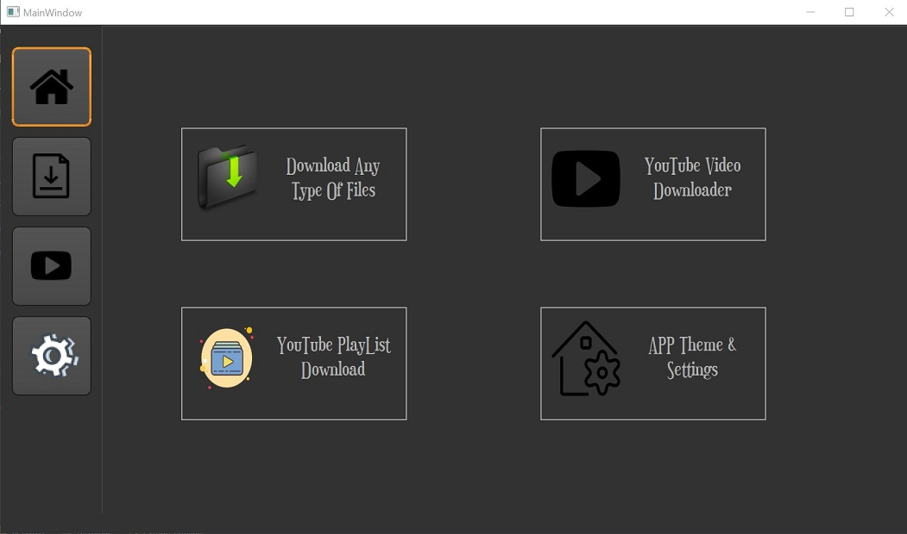
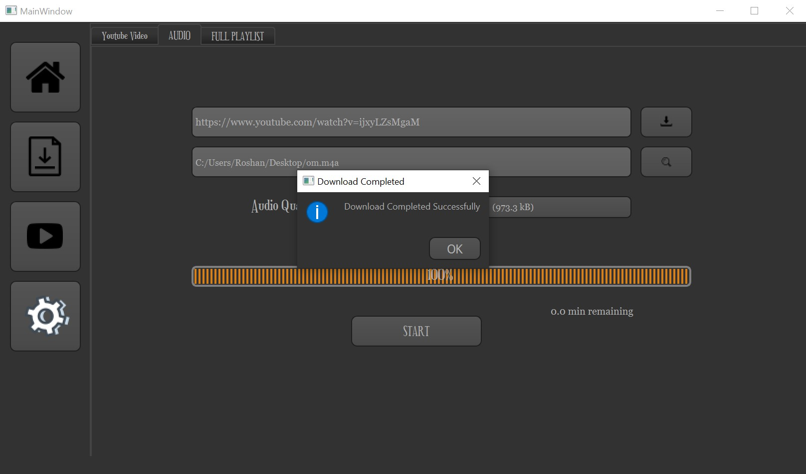
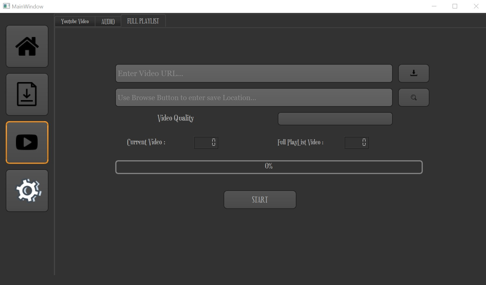
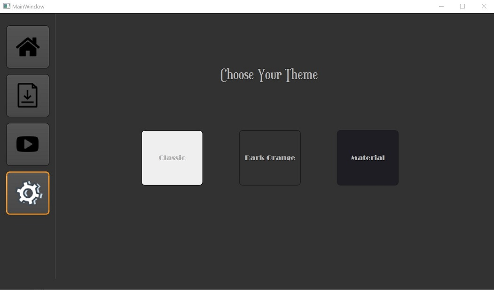

# Complete-Download-Manager
PyQt5 simple files , youtube videos, audio only from video URL and youtube playlist downloader

--------------------------------------------------------------------------
> ### Project Files :
 - index.py : the main project file , use it to run the project
 - main.ui : the UI file , you can edit it in the QtDesigner
 - photo.qrc : the qresource file which contains the icons paths
 - photo_rc.py : the icons files converted to python code

-----------------------------------------------------------------
> ### How To Run The Code :
First you have to make sure that you have python3 and PyQt5 installed.
Run index.py file to run the program

> ### SCREENSHOT

        
        
        </img>

        
        
        </img>

